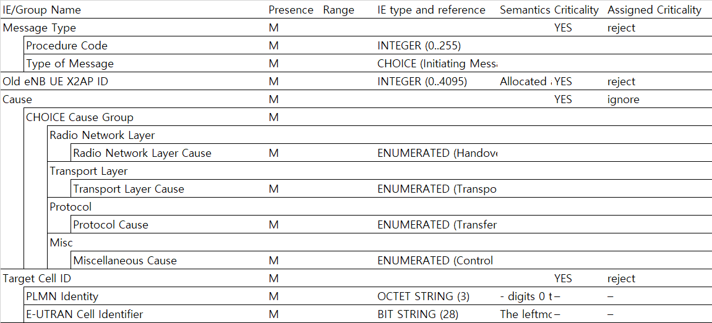

# 3GPP Message Formatter for RAN3

It generates an Excel workbook for all 3GPP Applicaiton Protocol (AP; 36.4xx, 38.4xx) messages/IEs



**Looking for [RAN2/RAN3 integrated binary][3gpp-message-formatter]?**

[3gpp-message-formatter]: https://github.com/gsongsong/3gpp-message-formatter

## Installation

```sh
npm i third-gen-message-formatter-ran3
```

### Dependencies

If above doesn't install dependencies:

```sh
npm i cellref cheerio excel4node
```


## Usage

- Convert 3GPP AP document into a web page format (*.htm, *.html)
   - Make sure that a web page is encoded in UTF-8

### Command Line

```sh
node formatter <spec_file>
# node formatter 38473-f11.htm
```

### Package

```js
var formatter = require('third-gen-message-formatter-ran3');
var workbook = formatter.format(html);
```
